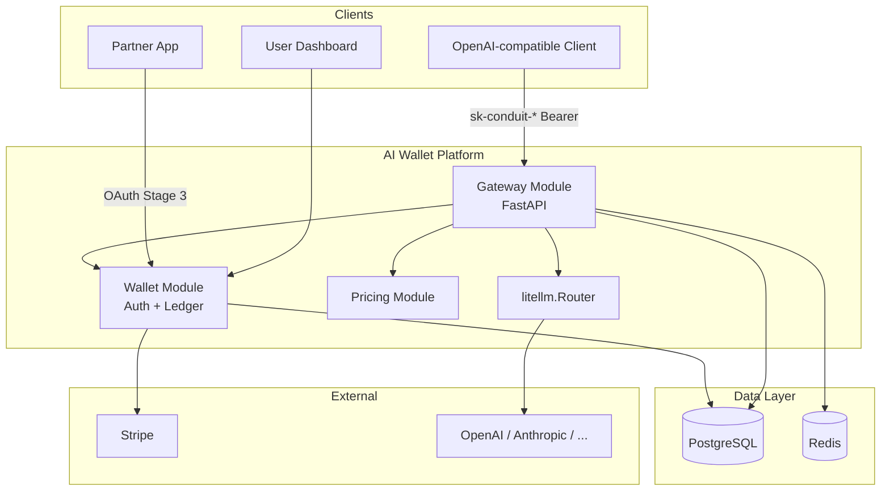
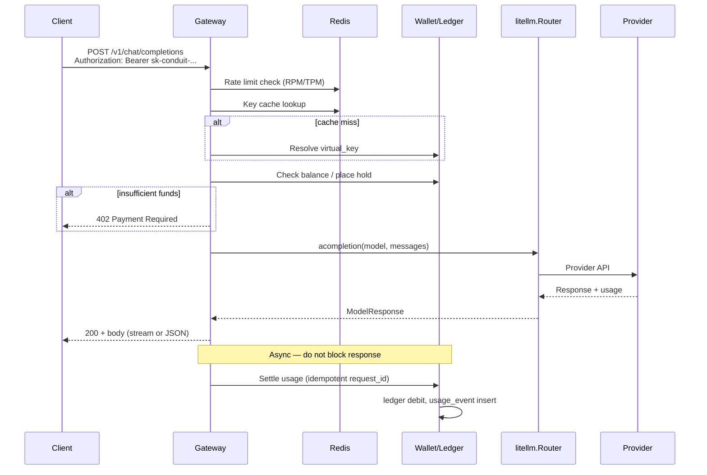
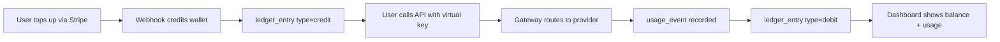

# System Architecture

Conduit — technical spine for Stage 0 → Stage 1 MVP.

---

## 1. Product architecture (three visible parts)

```
┌─────────────────────────────────────────────────────────────────┐
│                     CONDUIT                                      │
├─────────────────┬─────────────────────┬───────────────────────────┤
│  Login / Identity│  Prepaid Balance    │  AI Gateway               │
│  (task 2, 10)    │  (task 3, 4)        │  (task 7, 8)              │
└────────┬────────┴──────────┬──────────┴─────────────┬─────────────┘
         │                   │                        │
         └───────────────────┴────────────────────────┘
                    Shared PostgreSQL + Redis
```

**Positioning:** One identity, one balance, many apps — not "OpenRouter with login."

---

## 2. Service boundaries (MVP: modular monolith)

For MVP we deploy **one Python application** with clear internal modules. Split to microservices only when scale demands it.

```
services/
  gateway/          # OpenAI-compatible API, litellm.Router
  wallet/           # Auth, keys, balance, ledger, top-ups
  pricing/          # Price rules, cost allocation (Stage 2)
  shared/           # DB models, Redis, config, idempotency
```

External:

| System | Role |
|--------|------|
| **PostgreSQL** | Users, wallets, ledger, keys, usage, pricing |
| **Redis** | Key cache, rate limits, idempotency keys (short TTL) |
| **Stripe** | Top-ups only — no card data on our servers |
| **LLM providers** | OpenAI, Anthropic, etc. — keys in secrets manager |

---

## 3. Component diagram



---

## 4. Request lifecycle (chat completion)



### Lifecycle rules

| Step | Sync/async | Failure mode |
|------|------------|--------------|
| Key auth | Sync | 401 Unauthorized |
| Access group | Sync | 403 Forbidden |
| Balance check | Sync | 402 Payment Required |
| Rate limit | Sync | 429 Too Many Requests |
| Provider call | Sync | 502/503 upstream errors |
| Meter + deduct | **Async** | Retry queue; never double-charge |

---

## 5. Data flow: fund → call → deduct



---

## 6. Stage rollout vs architecture

| Stage | Architecture additions |
|-------|------------------------|
| **0** (now) | Docs, schema, API contracts |
| **1** MVP | Gateway + wallet + per-request settlement |
| **2** | Access groups, partner pricing, admin API |
| **3** | OIDC provider, app registrations, consent |
| **4** | Payout ledger, reconciliation jobs |
| **5** | HA gateway, async queue at scale, enterprise SSO |

---

## 7. Deployment (MVP minimal — task 12)

```
docker-compose:
  app:        FastAPI (gateway + wallet modules)
  postgres:   15+
  redis:      7+
```

Environment secrets: `DATABASE_URL`, `REDIS_URL`, `STRIPE_*`, `OPENAI_API_KEY`, `JWT_SECRET`, `MASTER_ENCRYPTION_KEY`.

Health: `GET /health` → DB ping, Redis ping, optional provider smoke flag.

---

## 8. Repo layout (target for task 11/12)

```
UniversalAiWallet/
  docs/                 # This folder
  schemas/              # SQL migrations
  openapi/              # API contracts
  services/
    app/
      main.py
      gateway/
      wallet/
      pricing/
  tests/
  docker-compose.yml
  pyproject.toml
```

Task 1 delivers `docs/`, `schemas/`, `openapi/` — application code starts in tasks 2–7.
