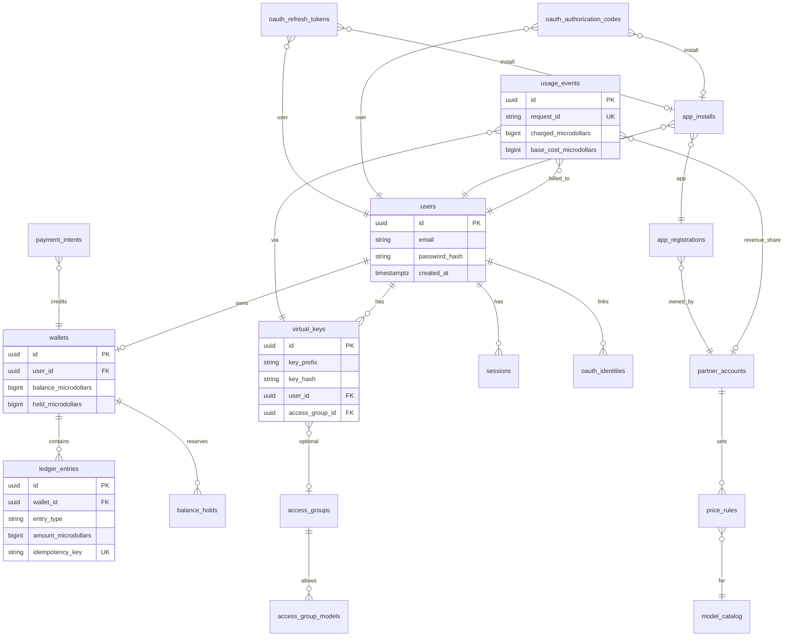

# Data Model

PostgreSQL is the system of record. Amounts are stored in **microdollars** (integer, 1 USD = 1_000_000) to avoid floating-point errors.

---

## 1. Entity relationship overview

---

## 2. Core entities (MVP)

### users

End-user identity. One user → one wallet in MVP (org wallets later).

| Column | Notes |
|--------|-------|
| `id` | UUID v4 |
| `email` | Unique, normalized lowercase |
| `password_hash` | bcrypt/argon2; null if OAuth-only |
| `status` | `active`, `suspended`, `deleted` |
| `email_verified_at` | Required before top-up in production |

### wallets

Prepaid balance container.

| Column | Notes |
|--------|-------|
| `balance_microdollars` | Settled funds |
| `held_microdollars` | Sum of active holds |
| `spend_limit_microdollars` | Optional monthly cap |
| `low_balance_threshold_microdollars` | Alert threshold |

**Invariant:** `available = balance_microdollars - held_microdollars >= 0`  
**Invariant:** Ledger sum of credits − debits = `balance_microdollars` (reconciliation job).

### virtual_keys

User-facing API keys (`sk-uaw-` prefix). Store **hash only** (HMAC-SHA256 with server pepper).

| Column | Notes |
|--------|-------|
| `key_prefix` | First 12 chars for display (`sk-uaw-abcd...`) |
| `key_hash` | Never store plaintext after creation |
| `rpm_limit`, `tpm_limit` | Rate limits; 0 = inherit default |
| `budget_microdollars` | Optional per-key cap (lifetime or period) |
| `revoked_at` | Non-null = key invalid |

### ledger_entries

Immutable financial log. No updates — corrections are reversing entries.

| `entry_type` | Direction | Example |
|--------------|-----------|---------|
| `credit` | + | Stripe top-up |
| `debit` | − | API usage settlement |
| `hold` | − available | Pre-request reservation |
| `hold_release` | + available | Request failed / over-estimate |
| `refund` | + | Admin adjustment |
| `adjustment` | ± | Manual correction |
| `settlement` | audit | Phase 7 partner payout (platform wallet anchor row; no balance mutation) |

Every entry has `idempotency_key` (unique per wallet) for safe retries.

### balance_holds

Short-lived reservations before provider call completes.

| Column | Notes |
|--------|-------|
| `estimated_max_microdollars` | Pessimistic upper bound |
| `request_id` | Ties to completion request |
| `status` | `active`, `settled`, `released`, `expired` |
| `expires_at` | Auto-release if provider hangs |

### usage_events

One row per completed (or failed-billable) API request.

| Column | Notes |
|--------|-------|
| `request_id` | Client or gateway generated; **unique** |
| `model` | Requested model name |
| `input_tokens`, `output_tokens` | From provider usage |
| `base_cost_microdollars` | From litellm cost map |
| `charged_microdollars` | What user paid (after markup) |
| `platform_fee_microdollars` | Our cut |
| `partner_margin_microdollars` | Partner cut (Stage 2) |
| `latency_ms`, `provider` | Observability |
| `status` | `completed`, `failed`, `blocked` |

### sessions

JWT/session store for dashboard and OAuth flows.

| Column | Notes |
|--------|-------|
| `token_hash` | Session identifier |
| `expires_at` | Sliding or absolute |
| `ip_address`, `user_agent` | Audit |

---

## 3. Stage 2+ entities

### partner_accounts

Company selling AI through our wallet (margin on usage).

- `name`, `slug`, `status`
- `default_platform_fee_bps` (basis points)
- `stripe_connect_account_id` (Stage 4 payouts)

### price_rules

Per-partner, per-model pricing.

- `model_id` → `model_catalog`
- `markup_bps` or `price_per_million_input_microdollars`
- `effective_from`, `effective_to` (versioning)

### model_catalog

Canonical model names exposed on gateway.

- `slug` (e.g. `gpt-4o`)
- `provider`, `litellm_model_id`
- `default_base_pricing` (cached from cost map)

### access_groups / access_group_models

LiteLLM-style entitlements.

- Group: `name`, `description`
- Join table: `model_id`, optional `feature_flags` JSON

### app_registrations / app_installs / OAuth tables (Stage 3 — implemented)

OAuth clients, user consent, and per-app spend allowances. Source of truth: `schemas/001_initial.sql` + `schemas/002_oauth_and_apps.sql`.

**`app_registrations`** — partner OAuth clients.

- `client_id` (`uaw_<random>`), `client_secret_hash` (HMAC), `redirect_uris[]`, `scopes[]`
- `is_active`, `logo_url`, `partner_account_id` (FK)

**`app_installs`** — a user's consented connection to an app; carries the per-app allowance.

- `spend_limit_microdollars` (nullable = unlimited), `allowance_spent_microdollars` (BigInt, incremented in the settle transaction)
- `allowance_reset_period` (`monthly` | `lifetime`), `last_reset_at`, `display_name`
- `consented_at`, `revoked_at`; unique on `(user_id, app_registration_id)`

**`oauth_authorization_codes`** — short-lived (120s) PKCE auth codes.

- `code_hash` (HMAC), `redirect_uri`, `scopes[]`, `pkce_code_challenge`, `pkce_code_challenge_method` (`S256` | `plain`)
- `app_install_id`, `expires_at`, `used_at` (set on exchange to prevent replay)

**`oauth_refresh_tokens`** — opaque, rotating, revocable.

- `token_hash` (HMAC), `scopes[]`, `app_install_id`, `expires_at`, `revoked_at`, `replaced_by_id`
- Rotation is atomic: revoke presented token + insert replacement in one transaction.

**`oauth_identities`** — external identity links for login (Google).

- `(provider, provider_sub)` unique; `user_id` FK. `get_or_create_oauth_user()` links on email or creates a passwordless user.

> All money columns are `*_microdollars` (BigInt, `$1.00 = 1_000_000`) to match the ledger. The gateway enforces the allowance on a Redis fast-path projection (`uaw:appallow:{app_install_id}`) with DB fallback on cache miss; see [04-api-contracts.md](./04-api-contracts.md) §5.

### payment_intents

Stripe checkout session tracking.

- `stripe_payment_intent_id`
- `amount_microdollars`, `status`
- Links to `ledger_entries` on `succeeded`

### settlement_batches (Phase 7 — implemented)

One payout record per partner per settlement run.

- `partner_account_id`, `period_start`, `period_end`
- `gross_usage_microdollars`, `platform_fee_microdollars`, `partner_payout_microdollars` (= gross − fee)
- `provider_cost_microdollars`, `partner_margin_microdollars`, `event_count`
- `reserved_event_ids` (UUID[]) — snapshot of claimed usage events
- `status` (`pending` | `cleared` | `failed`), `stripe_transfer_id` (UNIQUE), `idempotency_key` (UNIQUE per partner/day)
- `ledger_entry_id` → the append-only `settlement` ledger row on the platform wallet
- `error_message`, `cleared_at`

`usage_events` carries `settlement_status` (`pending` | `reserved` | `cleared` | `failed`) + `settlement_batch_id`, so a payout never claims an event twice. Reservation is an atomic `pending → reserved` update; reconciliation flips `reserved → cleared`. A failed transfer releases reserved events back to `pending` for re-attempt (same idempotency key reused). Schema: `schemas/003_settlement.sql`.

---

## 4. Key invariants

1. **No negative balance** — hard stop at gateway before provider call.
2. **Idempotent settlement** — same `request_id` never creates two debits.
3. **Immutable ledger** — append-only; reversals only via new entries.
4. **Key secrecy** — plaintext key shown once at creation.
5. **PCI boundary** — no card numbers in our tables; Stripe IDs only.

---

## 5. Indexing strategy

| Table | Index | Purpose |
|-------|-------|---------|
| `virtual_keys` | `key_hash` UNIQUE | Auth lookup |
| `ledger_entries` | `(wallet_id, created_at DESC)` | History |
| `ledger_entries` | `idempotency_key` UNIQUE | Retry safety |
| `usage_events` | `request_id` UNIQUE | Settlement idempotency |
| `usage_events` | `(user_id, created_at DESC)` | Dashboard |
| `balance_holds` | `(wallet_id, status)` WHERE active | Available balance calc |

---

## 6. SQL source of truth

See [`schemas/001_initial.sql`](../schemas/001_initial.sql) for executable DDL.
